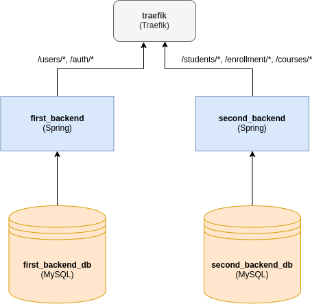

## Docker specs ##
* Nous avons utilisé Docker compose pour configurer l'architecture de notre système. (Docker engine 19.03.4)
La version de fichier Docker compose est 3.7 (car 3.7 est utilisé pour Docker Engine 18.06.0)

## Pré-Requis ##
Nous avons utilisé Java 11 pour le développement de cette application
Ubuntu 18.10

## Configuration Docker
Pour ce projet nous avons 5 conteneurs docker:
- Deux conteneurs MySQL 5.7.1. Chaque conteneur contient la base de données pour un serveur.
- Deux conteneurs contenant chacun un des backends que nous avons développé.
- Un conteneur contenant Traefik, un reverse-proxy qui redirige le trafic vers le serveur correspondant selon les règles que nous avons définies.

## Configuration du reverse proxy
Traefik est mis en avant dans le réseau, et redirige les requêtes vers les backends correspondant. Nous l'avons coniguré comme suit:
- Toutes les routes préfixées par "users" ou "auth" sont redirigé vers le premier backend.
- Toutes les routes préfixées par __"students"__, __"enrollments"__ ou __"courses"__ sont redirigé vers le deuxième backend.

Pour la configuration complète de l'architecture docker vous pouvez consulter le fichier docker compose.

## Configuration de Docker

Pour le déploiement de notre backend, nous avons fait usage de **Docker**, via sa technologie **Compose**. Plus précisément, nous avons utilisé les docker files de version **3.7** puisque notre Docker Engine était de la version 19.08. 

Nous avons utilisé la topologie suivante pour déployer notre projet en dans des conteneurs Docker.

ici, nous avons les conteneurs suivants:

* **Traefik** qui est un reverse proxy, qui redirige le traffic vers les conteneur sousjacents selon les règles prédéfinies pour le routage. Dans la suite, nous détaillons les règles de routage qui nous implémenté pour notre réseau.

* **first_backend** qui est le premier backend que nous avons utilisé. Il servira de SUT (Subject Under Test) pour notre project BDD, "users-specs". C'est un projet developpé à partir de Spring qui expose des API Rest pour l'authentification et la gestion des utilisateurs. Nous validons ces APIs avec CucumberJVM.

* **second_backend** qui est le second backedn que nous avons développé. Il servira aussi de SUT (Subject Under Test) pour notre deuxième projet BDD "employees-specs". 

* **first_server_db** et **second_server_db** sont des images docker contenant MySQL, le SGBD que nous avons choisi pour ce projet. Ces images sont respectivement connecté aux conteneurs **first_backend** et **second_backend**.

# Lancement du réseau docker
Pour lancer, allez dans le répertoire `docker/runtime` sur le terminal. Ensuite, exécuter la commande suivante:
`docker-compose up`
Cette commande utilisera le fichier `docker-compose.yml` qui batîra les différentrs images dockers pour les projets Spring si elles n'ont pas encore été créées (première exécution), ou alors utilisé un image déjà existante (après la première exécution"