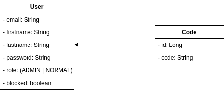

# Rapport Final du projet
Ce rapport fait état des résultats que nous avons obtenus dans le cadre du deuxième projet de l'AMT 2019.

## Liste des fonctionnalités
 Nous avons différentes api que nous avons développé dans ce projet. Toutes les a part certaines nécessitent une authentification avant de pouvoir les consomer. Ceci se fait par token **JWT(Json Web Token)**.
Donc pour pouvoir s'authentifier, il est nécessaire  Nous avons les endpoints suivants:

### Premier backend

##### Modèle du domaine
Nous avons le modèle de domaine donné par la figure ci-dessous:

 

Il n'y a que l'entité __User__ représentant l'utilisateur et __Code__ pour les codes qui seront envoyé pour vérification.

##### Fonctionnalités

- __Authentification__: Cette fonctionnalité permet à un utilisateur de s'authentifier. Pour cela il doit fournir un mot de passe et son adresse mail. Si ceci correspond à ce qui est sauvegarder en base de données alors un reçoit un token qui doit joindre à l'entête `Authorization` des requêtes suivantes sous la forme `Bearer [token]`. Cette fonctionnalité accessible en faisant un __POST__ vers l'URL `auth/login`.

- __Création des utilisateurs__: Ceci permet de créer un utilisateur dans le système. Cette fonctionnalité est exclusif à utilisateur qui a le rôle d'administrateur. Cette fonctionnalité est accessible en faisant un __POST__ vers l'URL `users`.

- __Modification du mot de passe__: Ceci permet à un utilisateur de modifier son mot de passe. Un utilisateur ne peut modifier le mot de passe d'un autre utilisateur. Cette fonctionnalité est accessible en faisant un __PUT__ vers l'URL `users/password`. Il nécessaire de s'authentifier avant de pouvoir consommer ce service.

- __Bloquer un utilisateur__: Ceci permet de bloquer un utilisateur. Cette fonctionallité est réservé à l'administrateur. Une fois l'utilisateur bloqué, il ne peut plus s'authentifier sur la plateforme. Cette fonctionnalité est accessible en faisant un __PUT__ vers l'URL `users/block/{email}`  ou `email` est l'adresse email de l'utilisateur que l'on veut bloquer.

- __Débloquer un utilisateur__: Ceci permet de débloquer un utilisateur. Cette fonctionallité est réservé à un utilisateur qui à le rôle d'administrateur. Une fois l'utilisateur bloqué, il peut s'authentifier sur la plateforme. Cette fonctionnalité est accessible en faisant un __DELETE__ vers l'URL `users/block/{email}`  ou `email` est l'adresse email de l'utilisateur que l'on veut bloquer.

- __Envoi de code__: Ceci envoi le code vers un adresse email fournie.
Ce fonctionnalité est accessible en faisant un __GET__ vers le chemin `users/code/{email}` ou  `email ` est l'adresse email du destinataire.

- __Vérification du code__: Ceci permet de vérifier que le dernier code envoyé correspond à ce qui est fourni. Cette fonctionnalité est accessible en faisant un __POST__ vers le chemin ` users/code`.

- __Réinitialisation du mot de passe__: Cette fonctionnalité permet de réinitialiser son mot de passe. Elle regroupe 3 routes:

	- __Demande de réinitialisation du mot de passe__: Envoi un mail vers l'email fourni contenant un lien pour réinitialiser le mot de passe. Ceci est accessible en faisant un __POST__ vers le chemin  ` users/forgotPassword`.
	- __Page de réinitialisation du mot de passe__: Retourne la page de réinitialisation du mot de passe. Pour cela il est nécessaire de fournir un token valide. Ceci est disponible en faisant un __GET__ vers le chemin  ` users/resetPassword` avec  `token` comme variable dans l'URL (ex:  `users/resetPassword?token=eyjf58lk... `)
	- __Réinitialiser le mot de passe__:  Ceci change réinitialiser effectivement le mot de passe. Pour cela il fournit le  __token__ et le __nouveau mot de passe__. Ceci est accessible en faisant __POST__ vers le chemin  `users/password`.
	
### Deuxième backend
##### Modèle du domaine
Pour le second backend, nous avons 2 entités principales à savoir __Student__(étudiant) et __Course__(cours). Nous avons ensuite une troisième entité __Enrollment__ qui marque l'enrôlement d'un étudiant à un cours.

Nous avons le modèle de domaine donné par la figure ci-dessous:

 

 
 ici nous avons modéliser l'association ternaire entre __Enrollment__ et les autres entités par une __relation unilateral__. En effet il n'y a que l'entité Enrollment qui contient des références vers les autres entités (__Student__ et __Course__) par des relations __ManyToOne__. 

##### Fonctionnalités
Pour les deux entités principales, nous avons les mêmes fonctionnalités à savoir le CRUD (__C__ reate, __R__ ead, __U__ pdate, __D__ elete). Nous les détaillons ci-dessous:

- __Création (Create)__: Par cela, nous parlons de la création d'une entité (Soit un __étudiant__, soit un __cours__). Cette fonctionnalité est accessible en faisant un `POST` vers le chemin  `students` pour créer un étudiant et  `course` pour créer un cours.
- __Récupération (Read)__: Ceci est la récupération des entités en base de données. Nous pouvons récupérer toutes les entités d'un type (Soit __étudiant__, soit __cours__) mais sous forme paginée. Ceci se fait en faisant un __GET__ vers le chemin  `students` pour les étudiants et  `courses` pour les cours. Nous pouvons ajouter le __numéro de page__ et la __taille de page__ comme variables d'URL. (ex:  `students?page=1&size=20`. Nous pouvons aussi récupérer une entité particulière en faisant un __GET__ vers le chemin  `students/{id}` où  `id` est l'identifiant de l'étudiant ou vers le chemin `courses/{id}` où  `id` est l'identifiant du cours.
- __Mise à jour (Update)__: Ceci est la modification d'une entité en base de données. Cette fonctionnalité est accessible en faisant un __PUT__ vers le chemin `students/{id}` où  `id` est l'identifiant de l'étudiant ou vers le chemin`courses/{id}` où  `id` est l'identifiant du cours. Dans le corps de la requête on met l'objet avec ses modifications.
-- __Suppression (Delete)__: Ceci est la suppression d'une entité en base de données. Lorsque nous supprimons une entité (__étudiant__ ou __cours__), nous supprimons les tous les __enrôlements__ liés à cet étudiant ou ce cours. Cette fonctionnalité est accessible en faisant un __DELETE__ vers le chemin `students/{id}` où  `id` est l'identifiant de l'étudiant ou vers le chemin `courses/{id}` où  `id` est l'identifiant du cours.

>il est à noté que pour la pagination, nous avons choisi l'option de l'__envelope__. L'enveloppe est un objet qui contient les champs:
>
>- __content__: Liste des elements de la page.
>- __pageNumber__: Numéro de page.
>- __pageSize__: Taille de la page.
>- __totalPages__: Nombre total de page selon la taille de la page.
>- __totalElements__: Nombre total des éléments.

Pour l'enrôlement, nous avons les opérations suivantes:
- __Création (Create)__: Ceci est es. Cette fonctionnalité est accessible en faisant un `POST` vers le chemin  `enrollments` pour créer un enrôlement. Dans le corps de la requête, nous fournissons l'identifiant de l'étudiant ent l'identifiant du cours.
- __Récupération (Read)__: Ceci est la récupération des enrôlements. Ceci se fait en faisant un __GET__ vers le chemin  `enrollments`. Nous pouvons ajouter le __numéro de page__ et la __taille de page__ comme variables d'URL. (ex:  `enrollments?page=1&size=20`. Nous pouvons aussi récupérer une entité particulière en faisant un __GET__ vers le chemin  `enrollments/{id}` où  `id` est l'identifiant de l'enrôlement.
-- __Suppression (Delete)__: Ceci est la suppression d'un enrôlement. Cette fonctionnalité est accessible en faisant un __DELETE__ vers le chemin `enrollments/{id}` où  `id` est l'identifiant de l'enrôlement

> Il est à noter que pour chacune de ses ressources, il y a un __owner__ et un utilisateur ne peut apporter des modifications (__R__ ead, __U__ pdate, __D__ elete) que sur des ressources dont il est le __"owner"__.

Pour plus d'informations vous pouvez consulter la documentation Swagger produite.

## Rapport sur les tests de validations sur Cucumber
Pour le développment de l'application, nous avons utilisé l'approche __BDD (Behaviour Driven Development)__. Donc pour valider le design nos APIs, nous avons utilisé l'approche BDD avec Cucumber JVM. Nous avons décrit des scénarios avec les valeurs que nous nous attendions de recevoir dans la logique d'un scénario qu'un utilisateur pourrait suivre.

Notre application a servi de SUT (Subject under test pour les test). Nous avons développé des applications qui s'exécute dans des conteneurs docker séparés et qui envoi des requêtes.

## Les difficultés rencontrées
- La configuration de Traefik n'a pas été rapide. Bien que sa configuration est simple, aboûtir à cette configuration n'a pas été facile. Pour plus d'information sur la configuration de Traefik pour le projet, vous pouvez consulter le document [docker.md](./docker.md).
- L'écriture des tests sur Cucumber. Sa prise en main, bien qu'étant simple, fut assez compliqué pour moi. La conception de tests adéquates pour valider les fonctionnalités que nous avons implémenté fit compliqué.

## Bugs et limitations

- Dans le cadre de ce projet, nous n'étions pas obligé de gérer ajouter la __gestion des tokens__. En effet, les tokens sont octroyé aux utilisateurs dès qu'ils se sont authentifiés mais ne sont pas conservé dans le système. Si un utilisateur entre en possession de ce token et l'utilise dans le système pendant qu'il est encore valide, il pourrait réaliser des opérations sur le système comme le détenteur du token.
- Je n'ai pas pu faire les commentaires sur les tests sur Jmeter et sur Cucumber faute de temps.

- 
